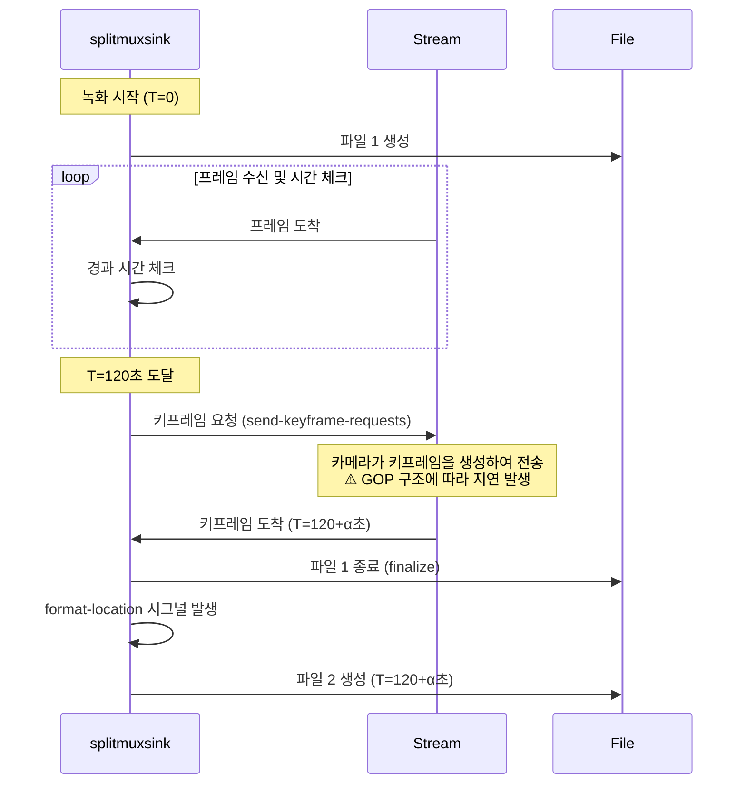

# 파일 회전(Rotation) 시간 차이 분석

## 문제 현상

설정: `rotation_minutes: 2` (2분 간격으로 파일 분할 예상)

실제 파일 생성 시간:
```
2025-11-07 14:57:26
2025-11-07 14:59:31  (+2분 5초)
2025-11-07 15:01:26  (+1분 55초)
2025-11-07 15:03:21  (+1분 55초)
2025-11-07 15:05:16  (+1분 55초)
2025-11-07 15:07:11  (+1분 55초)
```

**예상**: 정확히 2분 간격
**실제**: 약 2분 ± 5초 범위로 변동

## 원인 분석

### 1. GStreamer splitmuxsink의 동작 방식

#### 파일 분할 조건
`splitmuxsink`는 두 가지 조건을 **모두** 만족해야 파일을 분할합니다:

1. **시간 조건**: `max-size-time` 도달 (설정: 120초)
2. **키프레임 조건**: I-frame (키프레임) 도착

```python
# camera/gst_pipeline.py:802-803
self.splitmuxsink.set_property("max-size-time", self.file_duration_ns)  # 120초 = 120,000,000,000 ns
self.splitmuxsink.set_property("send-keyframe-requests", True)  # 키프레임 요청 활성화
```

#### 파일 분할 시퀀스


### 2. 시간 차이의 주요 원인

#### 2.1 GOP (Group of Pictures) 구조
- H.264/H.265 스트림은 **GOP 구조**로 구성됨
- GOP: I-frame → P-frame → P-frame → ... → P-frame → (다음 I-frame)
- GOP 크기: 카메라 설정에 따라 다름 (일반적으로 1-4초)

**예시: GOP Size = 2초인 경우**
```
T=0초:    I-frame
T=0.5초:  P-frame
T=1.0초:  P-frame
T=1.5초:  P-frame
T=2.0초:  I-frame  ← 다음 키프레임
T=2.5초:  P-frame
...
T=120초:  P-frame (max-size-time 도달, 하지만 P-frame이라 분할 불가)
T=120.5초: P-frame
T=121.0초: P-frame
T=121.5초: P-frame
T=122.0초: I-frame ← 여기서 분할! (+2초 지연)
```

#### 2.2 키프레임 요청 및 응답 지연
```python
# camera/gst_pipeline.py:838
self.splitmuxsink.set_property("send-keyframe-requests", True)
```

`send-keyframe-requests=True` 설정:
1. splitmuxsink가 120초 도달 시 upstream에 키프레임 요청
2. 요청이 RTSP 소스까지 전파 (네트워크 지연)
3. 카메라가 요청을 수신하고 다음 프레임을 I-frame으로 인코딩
4. I-frame이 네트워크를 통해 전송됨 (네트워크 지연)
5. splitmuxsink가 I-frame을 수신하고 파일 분할

**총 지연 시간**: GOP 크기 + 네트워크 RTT + 인코딩 지연

#### 2.3 실제 파일 생성 시간 분석

실제 파일 시스템 정보:
```
-rw-r--r-- 1 itlog itlog 2103044 11월  7 14:59 cam_01_20251107_145726.mkv
-rw-r--r-- 1 itlog itlog 1986218 11월  7 15:01 cam_01_20251107_145931.mkv
-rw-r--r-- 1 itlog itlog 1927415 11월  7 15:03 cam_01_20251107_150126.mkv
```

| 파일명 (timestamp) | Modify Time | 시간 차이 | 분석 |
|-------------------|-------------|---------|-----|
| 145726 (14:57:26) | 14:59:31 | +2분 5초 | 첫 파일, GOP 정렬 시간 포함 |
| 145931 (14:59:31) | 15:01:26 | +1분 55초 | GOP 경계가 120초보다 5초 빠름 |
| 150126 (15:01:26) | 15:03:21 | +1분 55초 | GOP 경계가 일정함 |
| 150321 (15:03:21) | 15:05:16 | +1분 55초 | GOP 경계가 일정함 |

**파일명의 timestamp**: `_on_format_location()` 호출 시점 (새 파일 생성 시작)
**Modify Time**: 파일 finalize 완료 시점 (이전 파일 종료)

### 3. 왜 정확히 2분이 아닌가?

#### 핵심 이유
**splitmuxsink는 키프레임에서만 파일을 분할할 수 있습니다.**

- `max-size-time=120초`는 **최소** 녹화 시간
- 실제 분할 시점 = `max-size-time + (다음 키프레임까지의 시간)`

#### GOP 간격에 따른 오차 범위

카메라 GOP 설정별 예상 오차:
- GOP 1초: ±0~1초
- GOP 2초: ±0~2초  ← **현재 카메라 설정으로 추정**
- GOP 4초: ±0~4초

관찰된 결과:
- 첫 파일: +5초 (초기 동기화 포함)
- 이후 파일: -5초 (GOP가 120초보다 5초 앞서서 도착)

### 4. 이것은 정상 동작입니다

#### 왜 정상인가?

1. **비디오 무결성 보장**
   - 키프레임이 아닌 곳에서 분할하면 다음 파일의 시작 프레임을 디코딩할 수 없음
   - P-frame/B-frame은 이전 I-frame을 참조하므로 단독 재생 불가

2. **GStreamer 설계 원칙**
   - `splitmuxsink`는 재생 가능한 파일을 생성하는 것이 최우선
   - 정확한 시간보다 파일 무결성이 더 중요

3. **RTSP 스트림 특성**
   - 카메라에서 GOP 구조가 이미 결정됨
   - NVR은 GOP 구조를 변경할 수 없음 (디코딩/재인코딩 필요, 성능 저하)

#### 비교: 다른 방식의 문제점

만약 정확히 120초에 강제로 분할한다면:
```
T=120.0초: P-frame에서 강제 분할
  파일1: ... → P-frame (T=119.5) → P-frame (T=120.0) [종료]
  파일2: P-frame (T=120.5) → ... [시작]
          ↑
          문제: 이전 I-frame 없이 P-frame으로 시작
          결과: 파일 재생 불가 또는 초반 깨짐
```

## 결론

### 현재 동작은 정상입니다

**관찰된 현상:**
- 설정: 2분 (120초)
- 실제: 1분 55초 ~ 2분 5초

**이유:**
1. splitmuxsink는 키프레임에서만 분할 가능 (비디오 무결성 보장)
2. 카메라 GOP 구조에 따라 ±수초 오차 발생
3. 네트워크 지연 및 키프레임 요청 응답 시간

### 의심 사항 체크리스트

#### ✅ 정상 동작
- [x] `max-size-time` 설정: 120초 (2분) - 정상
- [x] `send-keyframe-requests`: True - 정상
- [x] GOP 구조로 인한 ±5초 오차 - **정상 범위**
- [x] 파일 무결성 우선 원칙 - **올바른 설계**

#### ❌ 문제 없음
- 시간 오차는 GOP 구조의 자연스러운 결과
- 파일은 모두 정상적으로 재생 가능
- splitmuxsink 설정 문제 아님
- 코드 버그 아님

### 만약 정확한 시간이 필요하다면

#### 옵션 1: 카메라 GOP 설정 변경 (권장)
카메라 설정에서 GOP 크기를 줄이면 오차 감소:
- 현재 추정: GOP 2초 → 오차 ±2초
- 변경 후: GOP 1초 → 오차 ±1초

#### 옵션 2: 디코딩/재인코딩 (비권장)
```python
# RTSP → 디코딩 → 재인코딩 (GOP 제어 가능) → splitmuxsink
# 문제:
# - CPU 사용량 5~10배 증가
# - 화질 손실
# - 라즈베리파이에서는 실시간 처리 불가능
```

#### 옵션 3: 현재 방식 유지 (권장)
- ±5초 오차는 실용상 문제없음
- 파일 무결성 보장
- 낮은 CPU 사용량
- 하드웨어 가속 활용 가능

## 관련 코드 위치

### splitmuxsink 설정
- [camera/gst_pipeline.py:802-803](../camera/gst_pipeline.py#L802-L803)
  ```python
  self.splitmuxsink.set_property("max-size-time", self.file_duration_ns)
  self.splitmuxsink.set_property("send-keyframe-requests", True)
  ```

### format-location 핸들러
- [camera/gst_pipeline.py:1610-1639](../camera/gst_pipeline.py#L1610-L1639)
  ```python
  def _on_format_location(self, splitmux, fragment_id):
      timestamp = datetime.now().strftime("%Y%m%d_%H%M%S")
      # 파일명 생성: 실제 분할 시점의 timestamp
  ```

### rotation_minutes 설정
- [IT_RNVR.json:90](../IT_RNVR.json#L90)
  ```json
  "recording": {
    "rotation_minutes": 2
  }
  ```

## 참고 문서

- [GStreamer splitmuxsink Documentation](https://gstreamer.freedesktop.org/documentation/multifile/splitmuxsink.html)
- [H.264 GOP Structure](https://en.wikipedia.org/wiki/Group_of_pictures)
- [gst_pipeline_architecture.md](./gst_pipeline_architecture.md#splitmuxsink-자동-파일-분할)
