# GStreamer 통합 파이프라인 아키텍처 상세 분석

## 목차
1. [GStreamer 기본 개념](#1-gstreamer-기본-개념)
2. [통합 파이프라인 아키텍처](#2-통합-파이프라인-아키텍처)
3. [파이프라인 구성 요소](#3-파이프라인-구성-요소)
4. [기능별 동작 흐름](#4-기능별-동작-흐름)
5. [예외 처리 및 에러 복구](#5-예외-처리-및-에러-복구)
6. [성능 최적화 전략](#6-성능-최적화-전략)

---

## 1. GStreamer 기본 개념

### 1.1 GStreamer란?

GStreamer는 멀티미디어 처리를 위한 오픈소스 파이프라인 기반 프레임워크입니다. 비디오/오디오 스트리밍, 녹화, 변환, 재생 등 다양한 멀티미디어 작업을 처리할 수 있습니다.

**핵심 특징:**
- **파이프라인 아키텍처**: 데이터가 Element들을 순차적으로 통과하며 처리
- **플러그인 기반**: 다양한 코덱, 포맷, 프로토콜 지원
- **크로스 플랫폼**: Linux, Windows, macOS, Raspberry Pi 등 지원
- **하드웨어 가속**: GPU, 전용 디코더 칩셋 활용 가능

### 1.2 GStreamer 핵심 구성 요소

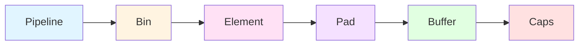

#### 1.2.1 Pipeline (파이프라인)
- GStreamer의 최상위 컨테이너
- 여러 Element를 포함하고 전체 데이터 흐름을 관리
- 상태 관리 (NULL → READY → PAUSED → PLAYING)

#### 1.2.2 Element (엘리먼트)
- 파이프라인의 기본 처리 단위
- 각 Element는 특정 기능을 수행 (디코딩, 인코딩, 필터링 등)
- **3가지 유형:**
  - **Source**: 데이터 생성 (rtspsrc, filesrc)
  - **Filter/Transform**: 데이터 변환 (decoder, converter, tee)
  - **Sink**: 데이터 소비 (videosink, filesink, splitmuxsink)

#### 1.2.3 Pad (패드)
- Element 간 연결 지점
- **Sink Pad**: 데이터 입력
- **Source Pad**: 데이터 출력
- **동적 Pad**: 런타임에 생성 (예: rtspsrc의 pad-added 시그널)

#### 1.2.4 Caps (Capabilities)
- Pad 간 전송 가능한 데이터 포맷 정의
- 예: `video/x-h264, width=1920, height=1080, framerate=30/1`

#### 1.2.5 Buffer
- 실제 미디어 데이터를 담는 컨테이너
- 타임스탬프, 메타데이터 포함

#### 1.2.6 Bus (버스)
- Element에서 발생한 메시지를 Pipeline에 전달하는 채널
- 메시지 타입: ERROR, WARNING, EOS, STATE_CHANGED 등

### 1.3 GStreamer 파이프라인 상태

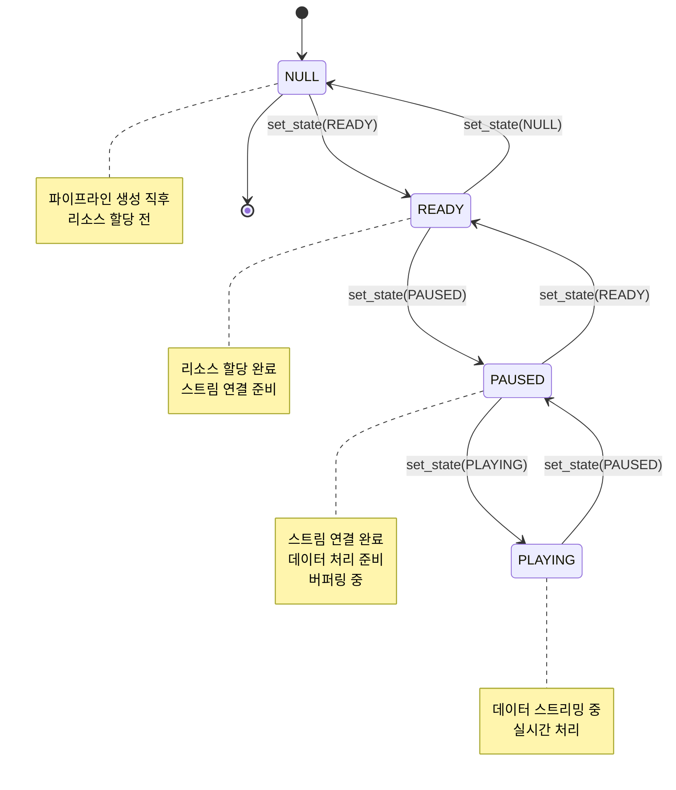

**상태별 특징:**

| 상태 | 설명 | 리소스 상태 |
|------|------|-------------|
| **NULL** | 초기 상태, 아무것도 할당되지 않음 | 미할당 |
| **READY** | 장치/파일 오픈, 리소스 할당 | 할당됨 |
| **PAUSED** | 스트림 연결, 버퍼링 (재생 직전) | 사용 가능 |
| **PLAYING** | 실시간 데이터 처리 중 | 활성 사용 중 |

---

## 2. 통합 파이프라인 아키텍처

### 2.1 통합 파이프라인의 핵심 개념

**문제 인식:**
- 기존 방식: 스트리밍과 녹화를 위한 **별도 파이프라인** 사용
- 결과: **중복 디코딩**으로 인한 높은 CPU 사용률 (~90% on Raspberry Pi)

**해결 방법:**
- **단일 파이프라인** + **Tee 엘리먼트** 사용
- 디코딩을 한 번만 수행하고 결과를 2개 브랜치로 분기
- **Valve 엘리먼트**로 각 브랜치를 동적으로 제어
- 결과: CPU 사용률 **~50% 감소**

### 2.2 전체 파이프라인 구조도

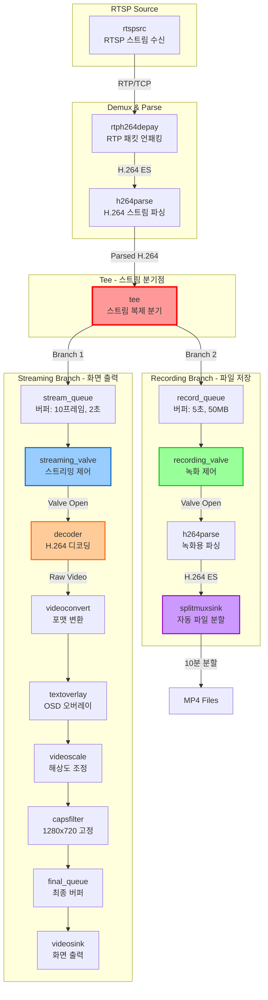

### 2.3 파이프라인 동작 모드

시스템은 3가지 동작 모드를 지원합니다 (PipelineMode Enum):

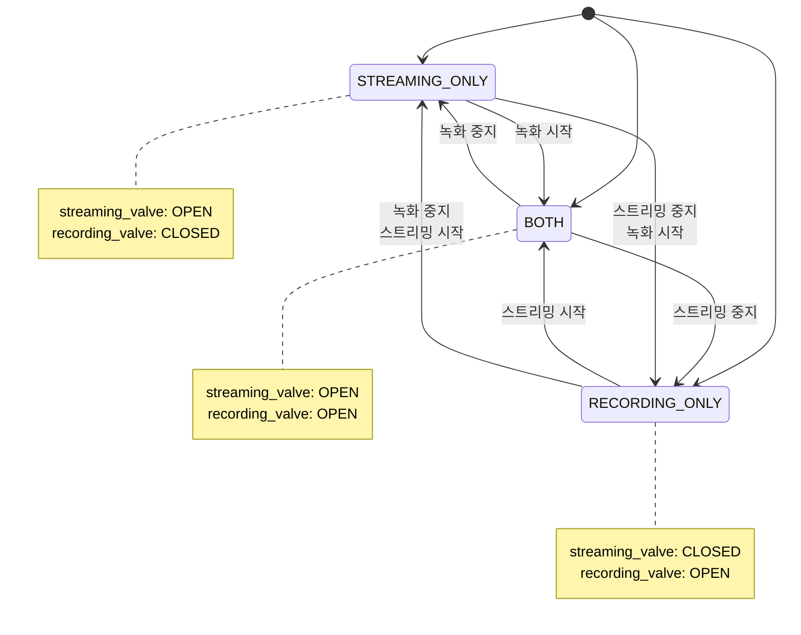

**Valve 제어 메커니즘:**

| 모드 | streaming_valve.drop | recording_valve.drop | 설명 |
|------|----------------------|----------------------|------|
| **STREAMING_ONLY** | False (열림) | True (닫힘) | 화면만 표시 |
| **RECORDING_ONLY** | True (닫힘) | False (열림) | 녹화만 수행 |
| **BOTH** | False (열림) | False (열림) | 스트리밍 + 녹화 |

**코드 위치:** `camera/gst_pipeline.py` - `_apply_mode_settings()` (Line 1026-1068)

---

## 3. 파이프라인 구성 요소

### 3.1 Source Branch (소스 브랜치)

#### 3.1.1 rtspsrc - RTSP 클라이언트

```python
rtspsrc = Gst.ElementFactory.make("rtspsrc", "source")
rtspsrc.set_property("location", rtsp_url)
rtspsrc.set_property("protocols", "tcp")  # TCP 사용 (안정성)
rtspsrc.set_property("latency", 200)      # 지연 시간 200ms
rtspsrc.set_property("tcp-timeout", 10000000)  # TCP 타임아웃 10초
rtspsrc.set_property("timeout", 10000000)      # 연결 타임아웃 10초
rtspsrc.set_property("retry", 5)               # 재시도 5회
```

**주요 속성:**

| 속성 | 값 | 설명 |
|------|-----|------|
| `location` | RTSP URL | 카메라 스트림 주소 |
| `protocols` | "tcp" | UDP 대신 TCP 사용 (패킷 손실 방지) |
| `latency` | 200ms | 버퍼링 지연 시간 (낮을수록 실시간성 향상) |
| `tcp-timeout` | 10초 | TCP 연결 타임아웃 |
| `retry` | 5회 | 연결 실패 시 재시도 횟수 |

**동적 Pad 연결:**
- rtspsrc는 스트림 연결 후 동적으로 Pad를 생성
- `pad-added` 시그널을 통해 depay 엘리먼트와 연결

```python
def _on_pad_added(self, src, pad, depay):
    """RTSP 소스의 동적 패드 연결"""
    pad_caps = pad.get_current_caps()
    structure = pad_caps.get_structure(0)
    name = structure.get_name()

    if name.startswith("application/x-rtp"):
        sink_pad = depay.get_static_pad("sink")
        if not sink_pad.is_linked():
            pad.link(sink_pad)
```

#### 3.1.2 rtph264depay - RTP Depayloader

RTP 패킷에서 H.264 Elementary Stream을 추출합니다.

```
Input:  application/x-rtp, media=video, encoding-name=H264
Output: video/x-h264, stream-format=byte-stream
```

#### 3.1.3 h264parse - H.264 Parser

H.264 스트림을 파싱하여 프레임 경계, NAL 유닛, 키프레임 정보를 추출합니다.

```python
parse = Gst.ElementFactory.make("h264parse", "parse")
parse.set_property("config-interval", 1)  # 1초마다 SPS/PPS 재전송
```

**config-interval의 중요성:**
- SPS/PPS는 H.264 스트림의 설정 정보 (해상도, 프로파일 등)
- 주기적으로 재전송하면 중간에 스트림에 접속해도 디코딩 가능
- 파일 분할 시 각 파일이 독립적으로 재생 가능

### 3.2 Tee - 스트림 분기

```python
self.tee = Gst.ElementFactory.make("tee", "tee")
self.tee.set_property("allow-not-linked", True)
```

**Tee Element의 역할:**
- 입력 스트림을 여러 출력으로 **복제**
- 각 브랜치가 독립적으로 동작 가능
- `allow-not-linked=True`: 한 브랜치가 끊겨도 다른 브랜치는 계속 동작

**Pad 연결 방법:**
```python
# 스트리밍 브랜치 연결
tee_pad = self.tee.request_pad_simple("src_%u")  # 동적 src pad 요청
queue_pad = stream_queue.get_static_pad("sink")
tee_pad.link(queue_pad)

# 녹화 브랜치 연결
tee_pad = self.tee.request_pad_simple("src_%u")  # 또 다른 src pad 요청
queue_pad = record_queue.get_static_pad("sink")
tee_pad.link(queue_pad)
```

### 3.3 Streaming Branch (스트리밍 브랜치)

#### 3.3.1 Queue - 버퍼 관리

```python
stream_queue = Gst.ElementFactory.make("queue", "stream_queue")
stream_queue.set_property("max-size-buffers", 10)     # 최대 10프레임
stream_queue.set_property("max-size-time", 2 * Gst.SECOND)  # 최대 2초
stream_queue.set_property("max-size-bytes", 0)        # 바이트 제한 없음
stream_queue.set_property("leaky", 2)                 # downstream leaky
```

**Queue 속성 설명:**

| 속성 | 값 | 설명 |
|------|-----|------|
| `max-size-buffers` | 10 | 최대 버퍼 개수 (프레임 수) |
| `max-size-time` | 2초 | 최대 버퍼 시간 (지연 시간 제어) |
| `max-size-bytes` | 0 | 바이트 제한 없음 |
| `leaky` | 2 | **Downstream leaky** - 큐가 가득 차면 오래된 데이터 버림 |

**Leaky 모드:**
- `0 (no leak)`: 큐가 가득 차면 업스트림이 블록됨
- `1 (upstream)`: 새 데이터가 들어오면 큐의 앞쪽 데이터를 버림
- `2 (downstream)`: 새 데이터가 들어오면 큐의 뒤쪽 데이터를 버림 ✅ **사용 중**

#### 3.3.2 Valve - 동적 흐름 제어

```python
self.streaming_valve = Gst.ElementFactory.make("valve", "streaming_valve")
self.streaming_valve.set_property("drop", False)  # False = 열림, True = 닫힘
```

**Valve의 동작:**
- `drop=False`: 데이터가 통과함 (밸브 열림) ✅
- `drop=True`: 데이터를 버림 (밸브 닫힘) ❌

**런타임 제어:**
```python
# 스트리밍 시작
self.streaming_valve.set_property("drop", False)

# 스트리밍 중지
self.streaming_valve.set_property("drop", True)
```

#### 3.3.3 Decoder - 비디오 디코딩

```python
# 하드웨어 가속 디코더 자동 선택
decoder_name = get_available_decoder(
    codec='h264',
    prefer_hardware=True,
    decoder_preference=None
)
decoder = Gst.ElementFactory.make(decoder_name, "decoder")
```

**디코더 우선순위 (Raspberry Pi):**

1. **v4l2h264dec** - V4L2 하드웨어 디코더 (Raspberry Pi 4+)
2. **omxh264dec** - OpenMAX 하드웨어 디코더 (Raspberry Pi 3-)
3. **avdec_h264** - libav 소프트웨어 디코더 (폴백)

**디코더 비교:**

| 디코더 | 플랫폼 | 성능 | CPU 사용률 |
|--------|--------|------|-----------|
| v4l2h264dec | RPi 4+ | 우수 | ~10% |
| omxh264dec | RPi 3- | 양호 | ~15% |
| avdec_h264 | 모든 플랫폼 | 낮음 | ~70% |

**코드 위치:** `camera/gst_utils.py` - `get_available_decoder()` (Line 76-139)

#### 3.3.4 Video Processing Chain

```python
# 포맷 변환
convert = Gst.ElementFactory.make("videoconvert", "convert")

# OSD 텍스트 오버레이
self.text_overlay = Gst.ElementFactory.make("textoverlay", "text_overlay")
self.text_overlay.set_property("font-desc", "Sans Bold 14")
self.text_overlay.set_property("shaded-background", True)
self.text_overlay.set_property("valignment", "top")
self.text_overlay.set_property("halignment", "left")

# 해상도 조정
scale = Gst.ElementFactory.make("videoscale", "scale")

# 해상도 고정
caps_filter = Gst.ElementFactory.make("capsfilter", "caps_filter")
caps = Gst.Caps.from_string("video/x-raw,width=1280,height=720")
caps_filter.set_property("caps", caps)
```

**처리 흐름:**
```
Raw Video (YUV) → videoconvert → textoverlay → videoscale → capsfilter → video_sink
```

#### 3.3.5 Text Overlay (OSD)

**OSD 구성:**
- 카메라 이름
- 타임스탬프 (YYYY-MM-DD HH:MM:SS)
- 녹화 상태 표시

**타임스탬프 업데이트:**
```python
def _start_timestamp_update(self):
    """타임스탬프 업데이트 타이머 시작"""
    def update_timestamp():
        if self._is_playing and self.text_overlay:
            text_parts = []
            if show_camera_name:
                text_parts.append(self.camera_name)
            if show_timestamp:
                text_parts.append(datetime.now().strftime("%Y-%m-%d %H:%M:%S"))

            new_text = " | ".join(text_parts)
            self.text_overlay.set_property("text", new_text)

            # 1초마다 업데이트
            self._timestamp_update_timer = threading.Timer(1.0, update_timestamp)
            self._timestamp_update_timer.start()

    update_timestamp()
```

**코드 위치:** `camera/gst_pipeline.py` - `_start_timestamp_update()` (Line 1100-1129)

#### 3.3.6 Video Sink - 화면 출력

플랫폼별 최적 비디오 싱크 자동 선택:

**Windows:**
- d3d11videosink (Windows 10+)
- d3dvideosink (Windows 7/8)

**Linux/Raspberry Pi:**
- glimagesink (OpenGL, 가장 효율적)
- xvimagesink (X11 with XVideo)
- ximagesink (X11 기본)

**Video Sink 속성:**
```python
video_sink.set_property("sync", False)  # 비동기 렌더링 (저지연)
video_sink.set_property("async", False)  # 즉시 PLAYING 상태 전환
video_sink.set_property("qos", True)     # QoS 활성화 (프레임 드롭 가능)
video_sink.set_property("max-lateness", 20 * Gst.MSECOND)  # 최대 지연 20ms
```

**코드 위치:** `camera/gst_utils.py` - `get_video_sink()` (Line 18-59)

### 3.4 Recording Branch (녹화 브랜치)

#### 3.4.1 Recording Queue

```python
record_queue = Gst.ElementFactory.make("queue", "record_queue")
record_queue.set_property("max-size-buffers", 0)              # 무제한
record_queue.set_property("max-size-time", 5 * Gst.SECOND)   # 5초 버퍼
record_queue.set_property("max-size-bytes", 50 * 1024 * 1024)  # 50MB
record_queue.set_property("leaky", 2)                         # downstream leaky
```

**스트리밍 큐와의 차이점:**
- **더 큰 버퍼**: 파일 쓰기 지연 대응
- **바이트 제한**: 메모리 사용량 제어

#### 3.4.2 Recording Valve

```python
self.recording_valve = Gst.ElementFactory.make("valve", "recording_valve")
self.recording_valve.set_property("drop", True)  # 초기에는 닫힌 상태
```

**녹화 제어 흐름:**
```python
def start_recording(self):
    """녹화 시작"""
    self._is_recording = True
    self.recording_valve.set_property("drop", False)  # Valve 열기
    self._notify_recording_state_change(True)

def stop_recording(self):
    """녹화 중지"""
    self.recording_valve.set_property("drop", True)   # Valve 닫기
    self._is_recording = False
    self._notify_recording_state_change(False)
```

#### 3.4.3 h264parse (Recording)

```python
record_parse = Gst.ElementFactory.make("h264parse", "record_parse")
record_parse.set_property("config-interval", 1)  # SPS/PPS 재전송
```

**스트리밍 브랜치의 parse와 분리된 이유:**
- Tee 이후 각 브랜치가 독립적으로 동작
- 녹화용 파싱은 파일 저장에 최적화

#### 3.4.4 splitmuxsink - 자동 파일 분할

```python
self.splitmuxsink = Gst.ElementFactory.make("splitmuxsink", "splitmuxsink")
self.splitmuxsink.set_property("max-size-time", self.file_duration_ns)
self.splitmuxsink.set_property("muxer-factory", "mp4mux")
self.splitmuxsink.set_property("async-handling", True)
self.splitmuxsink.set_property("send-keyframe-requests", True)
```

**splitmuxsink 핵심 속성:**

| 속성 | 값 | 설명 |
|------|-----|------|
| `max-size-time` | 600초 (10분) | 파일 분할 시간 (나노초 단위) |
| `muxer-factory` | "mp4mux" | 사용할 Muxer 지정 |
| `async-handling` | True | 비동기 파일 처리 |
| `send-keyframe-requests` | True | 키프레임 요청 (정확한 분할) |

**파일 분할 메커니즘:**

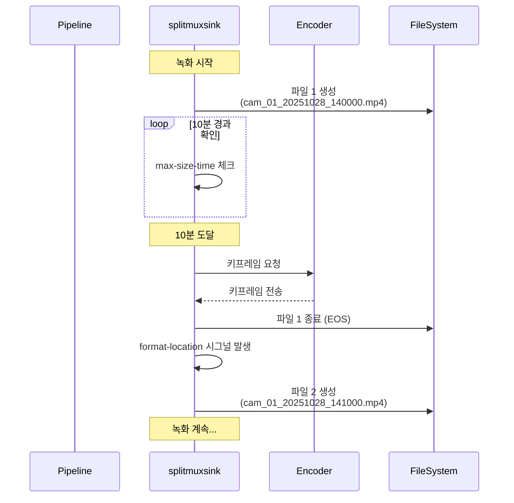

**format-location 시그널 핸들러:**

```python
def _on_format_location(self, splitmux, fragment_id):
    """
    splitmuxsink의 format-location 시그널 핸들러
    새 파일이 생성될 때마다 호출됨
    """
    date_dir = self.recording_dir / datetime.now().strftime("%Y%m%d")
    date_dir.mkdir(exist_ok=True)
    timestamp = datetime.now().strftime("%Y%m%d_%H%M%S")
    file_path = str(date_dir / f"{self.camera_id}_{timestamp}.{self.file_format}")

    logger.info(f"Creating recording file: {file_path} (fragment #{fragment_id})")
    return file_path
```

**파일 조직 구조:**
```
recordings/
├── cam_01/
│   ├── 20251028/
│   │   ├── cam_01_20251028_140000.mp4  (10분)
│   │   ├── cam_01_20251028_141000.mp4  (10분)
│   │   └── cam_01_20251028_142000.mp4  (10분)
│   └── 20251029/
│       ├── cam_01_20251029_090000.mp4
│       └── ...
└── cam_02/
    └── ...
```

**코드 위치:** `camera/gst_pipeline.py` - `_create_recording_branch()` (Line 466-574)

---

## 4. 기능별 동작 흐름

### 4.1 파이프라인 생성 (create_pipeline)

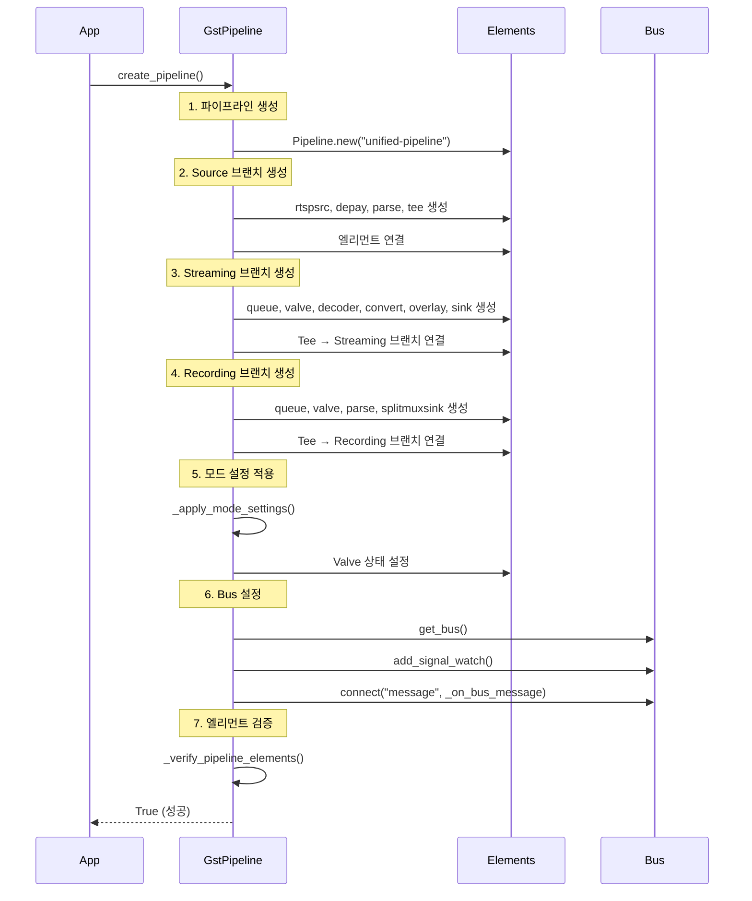

**코드 위치:** `camera/gst_pipeline.py` - `create_pipeline()` (Line 118-224)

**주요 단계:**

1. **Pipeline 객체 생성**
   ```python
   self.pipeline = Gst.Pipeline.new("unified-pipeline")
   ```

2. **Source 브랜치 생성** (rtspsrc → depay → parse → tee)
   - RTSP 소스 설정 (latency, timeout, retry)
   - 동적 Pad 연결 설정 (`pad-added` 시그널)

3. **Streaming 브랜치 생성** (_create_streaming_branch)
   - 디코더 자동 선택 (하드웨어 가속 우선)
   - OSD 설정 (카메라 이름, 타임스탬프)
   - 비디오 싱크 플랫폼별 선택

4. **Recording 브랜치 생성** (_create_recording_branch)
   - splitmuxsink 설정 (파일 분할 시간, muxer)
   - format-location 핸들러 연결

5. **Valve 초기 상태 설정**
   - 모드에 따라 각 브랜치의 valve 상태 결정

6. **Bus 메시지 핸들러 등록**
   - ERROR, WARNING, EOS, STATE_CHANGED 처리

7. **파이프라인 검증**
   - 모든 필수 엘리먼트가 존재하는지 확인

### 4.2 파이프라인 시작 (start)

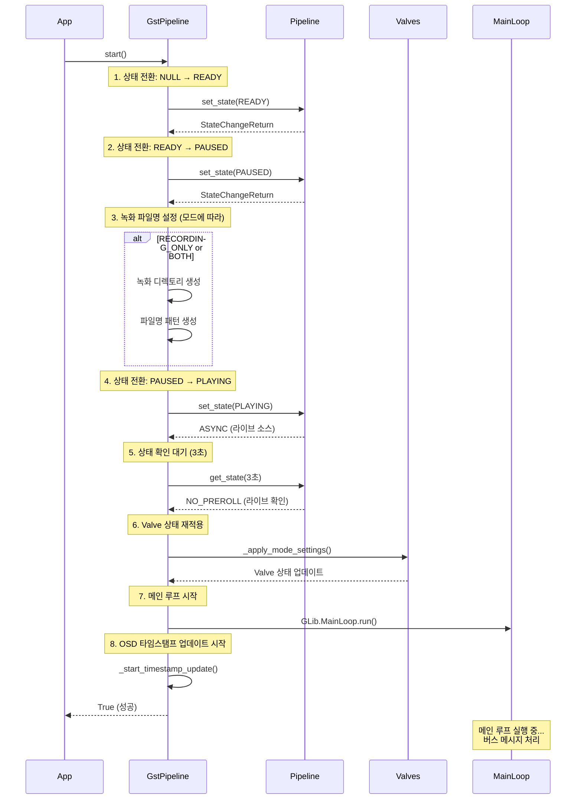

**코드 위치:** `camera/gst_pipeline.py` - `start()` (Line 650-775)

**주요 단계:**

1. **NULL → READY 전환**
   - 리소스 할당 (네트워크 연결, 파일 오픈 등)
   - 실패 시 에러 메시지 확인

2. **READY → PAUSED 전환**
   - 스트림 연결 시작
   - 버퍼링 시작

3. **녹화 파일명 설정** (녹화 모드인 경우)
   ```python
   timestamp = datetime.now().strftime("%Y%m%d_%H%M%S")
   date_dir = self.recording_dir / datetime.now().strftime("%Y%m%d")
   date_dir.mkdir(exist_ok=True)
   location_pattern = str(date_dir / f"{self.camera_id}_{timestamp}_%05d.{self.file_format}")
   self.splitmuxsink.set_property("location", location_pattern)
   ```

4. **PAUSED → PLAYING 전환**
   - 실시간 스트리밍 시작
   - 라이브 소스는 ASYNC 반환 (비동기 처리)

5. **상태 확인 대기**
   - `get_state(3초)` 호출
   - 라이브 소스는 `NO_PREROLL` 반환 (정상)
   - RTSP 연결이 안 되면 타임아웃

6. **Valve 재적용**
   - 상태 전환 중 valve 설정이 리셋될 수 있음
   - 명시적으로 재설정

7. **GLib 메인 루프 시작**
   ```python
   self._main_loop = GLib.MainLoop()
   self._thread = threading.Thread(target=self._run_main_loop)
   self._thread.daemon = True
   self._thread.start()
   ```
   - 별도 스레드에서 메인 루프 실행
   - 버스 메시지 비동기 처리

8. **OSD 타임스탬프 업데이트 시작**
   - 1초마다 타이머로 텍스트 업데이트

### 4.3 녹화 시작 (start_recording)

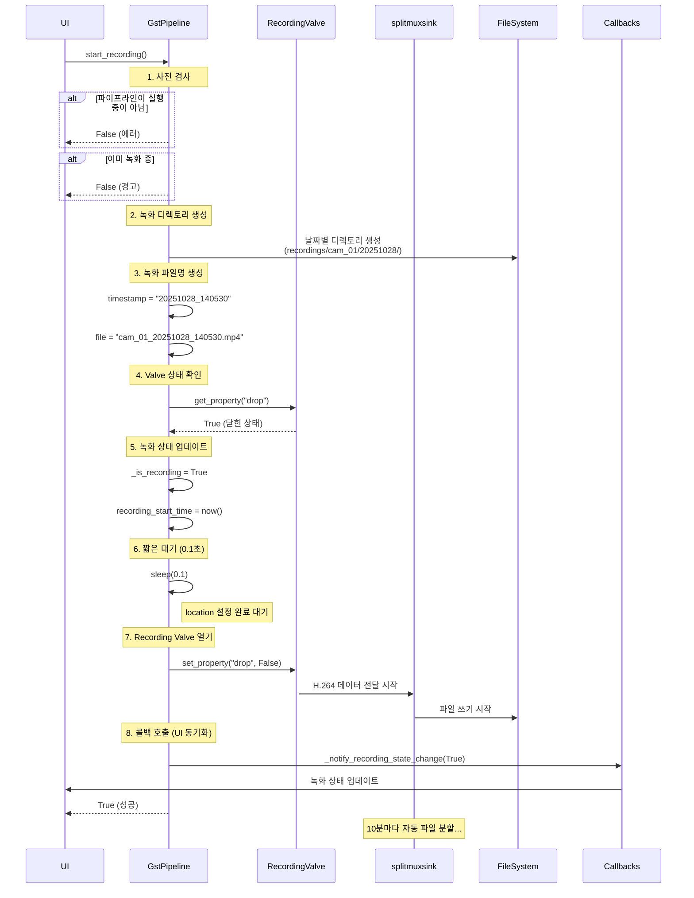

**코드 위치:** `camera/gst_pipeline.py` - `start_recording()` (Line 800-853)

**주요 단계:**

1. **사전 검사**
   - 파이프라인이 실행 중인지 확인
   - 이미 녹화 중인지 확인

2. **녹화 디렉토리 생성**
   ```python
   date_dir = self.recording_dir / datetime.now().strftime("%Y%m%d")
   date_dir.mkdir(exist_ok=True)
   ```

3. **녹화 파일명 생성**
   ```python
   timestamp = datetime.now().strftime("%Y%m%d_%H%M%S")
   self.current_recording_file = str(date_dir / f"{self.camera_id}_{timestamp}.{self.file_format}")
   ```

4. **Valve 상태 확인**
   - 현재 valve가 닫혀 있는지 확인 (중복 방지)

5. **내부 상태 업데이트**
   ```python
   self._is_recording = True
   self.recording_start_time = time.time()
   ```

6. **짧은 대기**
   - splitmuxsink의 location 설정이 완료되도록 0.1초 대기

7. **Recording Valve 열기**
   ```python
   self.recording_valve.set_property("drop", False)
   ```
   - 이 순간부터 H.264 데이터가 splitmuxsink로 흐름
   - splitmuxsink가 파일 쓰기 시작

8. **UI 동기화 콜백 호출**
   ```python
   self._notify_recording_state_change(True)
   ```
   - 등록된 모든 콜백 함수 호출
   - UI가 녹화 상태를 즉시 반영

### 4.4 녹화 중지 (stop_recording)

```mermaid
sequenceDiagram
    participant UI
    participant GstPipeline
    participant RecordingValve
    participant splitmuxsink
    participant FileSystem
    participant Callbacks

    UI->>GstPipeline: stop_recording()

    Note over GstPipeline: 1. 녹화 중 확인
    alt 녹화 중이 아님
        GstPipeline-->>UI: False (경고)
    end

    Note over GstPipeline: 2. Recording Valve 닫기
    GstPipeline->>RecordingValve: set_property("drop", True)
    deactivate RecordingValve
    Note right of RecordingValve: H.264 데이터 차단

    Note over GstPipeline: 3. splitmuxsink 파일 종료 요청
    GstPipeline->>splitmuxsink: emit("split-now")
    alt split-now 실패
        GstPipeline->>splitmuxsink: send_event(EOS)
    end

    splitmuxsink->>FileSystem: 현재 파일 종료 (EOS 처리)
    FileSystem-->>splitmuxsink: 파일 닫기 완료

    Note over GstPipeline: 4. 파일 종료 대기
    GstPipeline->>GstPipeline: sleep(0.5초)
    Note right of GstPipeline: EOS 처리 및 파일 완료 대기

    Note over GstPipeline: 5. 녹화 상태 업데이트
    GstPipeline->>GstPipeline: _is_recording = False
    GstPipeline->>GstPipeline: recording_start_time = None
    GstPipeline->>GstPipeline: current_recording_file = None

    Note over GstPipeline: 6. 콜백 호출 (UI 동기화)
    GstPipeline->>Callbacks: _notify_recording_state_change(False)
    Callbacks->>UI: 녹화 중지 상태 업데이트

    GstPipeline-->>UI: True (성공)
```

**코드 위치:** `camera/gst_pipeline.py` - `stop_recording()` (Line 855-908)

**주요 단계:**

1. **녹화 중 확인**
   - `_is_recording` 플래그 확인

2. **Recording Valve 닫기**
   ```python
   self.recording_valve.set_property("drop", True)
   ```
   - 즉시 H.264 데이터 차단

3. **splitmuxsink 파일 종료 요청**
   ```python
   try:
       self.splitmuxsink.emit("split-now")
   except:
       pad = self.splitmuxsink.get_static_pad("video")
       if pad:
           pad.send_event(Gst.Event.new_eos())
   ```
   - `split-now` 시그널: 현재 파일을 깔끔하게 종료
   - 실패 시 EOS 이벤트 직접 전송

4. **파일 종료 대기**
   ```python
   time.sleep(0.5)
   ```
   - splitmuxsink가 파일을 완전히 닫을 시간 제공
   - 너무 짧으면 파일이 손상될 수 있음

5. **내부 상태 초기화**
   ```python
   self._is_recording = False
   self.recording_start_time = None
   self.current_recording_file = None
   ```

6. **UI 동기화 콜백 호출**
   ```python
   self._notify_recording_state_change(False)
   ```

### 4.5 파이프라인 중지 (stop)

```mermaid
sequenceDiagram
    participant App
    participant GstPipeline
    participant Pipeline
    participant RecordingValve
    participant MainLoop
    participant Thread

    App->>GstPipeline: stop()

    Note over GstPipeline: 1. OSD 타임스탬프 업데이트 중지
    GstPipeline->>GstPipeline: _stop_timestamp_update()

    Note over GstPipeline: 2. 녹화 중이면 먼저 중지
    alt _is_recording == True
        GstPipeline->>GstPipeline: stop_recording()
        GstPipeline->>RecordingValve: Valve 닫기
        GstPipeline->>GstPipeline: 파일 종료 대기
    end

    Note over GstPipeline: 3. 파이프라인 상태 전환: PLAYING → NULL
    GstPipeline->>Pipeline: set_state(NULL)
    Pipeline-->>GstPipeline: StateChangeReturn

    Note over Pipeline: 모든 리소스 해제<br/>파일 핸들, 네트워크 연결 종료

    Note over GstPipeline: 4. 상태 플래그 업데이트
    GstPipeline->>GstPipeline: _is_playing = False

    Note over GstPipeline: 5. 메인 루프 종료
    GstPipeline->>MainLoop: quit()
    deactivate MainLoop

    Note over GstPipeline: 6. 스레드 종료 대기
    GstPipeline->>Thread: join(timeout=2.0)
    Thread-->>GstPipeline: 스레드 종료 완료

    GstPipeline-->>App: 파이프라인 중지 완료
```

**코드 위치:** `camera/gst_pipeline.py` - `stop()` (Line 777-798)

**주요 단계:**

1. **OSD 타임스탬프 업데이트 중지**
   ```python
   self._stop_timestamp_update()
   ```
   - 타이머 취소

2. **녹화 중지** (녹화 중인 경우)
   ```python
   if self._is_recording:
       self.stop_recording()
   ```

3. **파이프라인 상태를 NULL로 전환**
   ```python
   self.pipeline.set_state(Gst.State.NULL)
   ```
   - 모든 리소스 해제
   - 네트워크 연결 종료
   - 파일 핸들 닫기

4. **상태 플래그 업데이트**
   ```python
   self._is_playing = False
   ```

5. **메인 루프 종료**
   ```python
   if self._main_loop:
       self._main_loop.quit()
   ```

6. **스레드 종료 대기**
   ```python
   if self._thread and self._thread.is_alive():
       self._thread.join(timeout=2.0)
   ```
   - 최대 2초 대기
   - 데몬 스레드이므로 프로그램 종료 시 강제 종료됨

### 4.6 런타임 모드 변경 (set_mode)

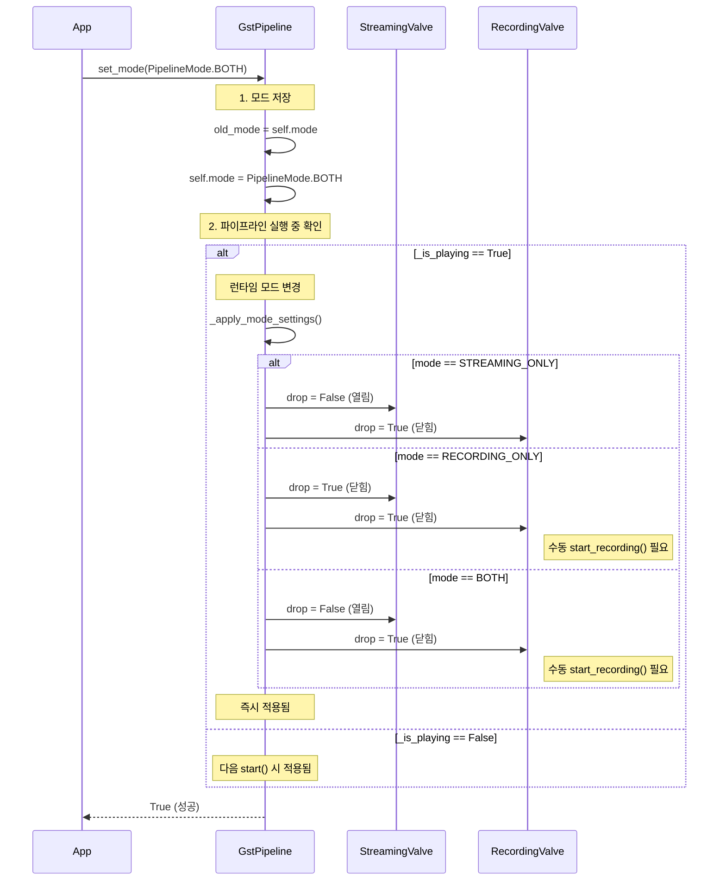

**코드 위치:** `camera/gst_pipeline.py` - `set_mode()` (Line 1069-1081)

**런타임 모드 변경의 핵심:**
- **파이프라인 재생성 불필요**
- **Valve만 제어**하여 즉시 전환
- 스트리밍 중단 없이 녹화 시작/중지 가능

**예제 시나리오:**

```python
# 1. 스트리밍만 시작
pipeline.mode = PipelineMode.STREAMING_ONLY
pipeline.create_pipeline()
pipeline.start()
# → 화면에만 표시, 녹화 안 함

# 2. 녹화 추가 (런타임 중)
pipeline.set_mode(PipelineMode.BOTH)
pipeline.start_recording()
# → 화면 표시 + 녹화 동시 진행

# 3. 스트리밍 중지 (런타임 중)
pipeline.set_mode(PipelineMode.RECORDING_ONLY)
# → 녹화만 계속, 화면은 정지

# 4. 다시 스트리밍 추가
pipeline.set_mode(PipelineMode.BOTH)
# → 화면 다시 표시, 녹화는 계속
```

---

## 5. 예외 처리 및 에러 복구

### 5.1 Bus 메시지 처리

```mermaid
graph TD
    A[Bus Message] --> B{메시지 타입?}

    B -->|ERROR| C[_on_bus_message: ERROR]
    B -->|WARNING| D[_on_bus_message: WARNING]
    B -->|EOS| E[_on_bus_message: EOS]
    B -->|STATE_CHANGED| F[_on_bus_message: STATE_CHANGED]

    C --> C1{에러 소스 확인}
    C1 -->|녹화 브랜치| C2[녹화 에러 처리<br/>valve 상태 로깅]
    C1 -->|비디오 싱크| C3{윈도우 핸들?}
    C3 -->|없음| C4[에러 무시<br/>테스트 모드]
    C3 -->|있음| C5[에러 로깅]
    C1 -->|기타| C6[파이프라인 중지<br/>stop()]

    D --> D1[경고 로깅]
    D1 --> D2{녹화 브랜치?}
    D2 -->|예| D3[상세 로깅]

    E --> E1[EOS 로깅]
    E1 --> E2[파일 회전 완료]

    F --> F1{파이프라인?}
    F1 -->|예| F2[상태 전환 로깅]

    style C fill:#ffcccc
    style C2 fill:#ffddaa
    style C6 fill:#ff9999
    style D fill:#ffffcc
    style E fill:#ccffcc
    style F fill:#ccccff
```

**코드 위치:** `camera/gst_pipeline.py` - `_on_bus_message()` (Line 606-648)

### 5.2 에러 타입별 처리

#### 5.2.1 ERROR 메시지

```python
def _on_bus_message(self, bus, message):
    """버스 메시지 처리"""
    t = message.type

    if t == Gst.MessageType.ERROR:
        err, debug = message.parse_error()
        src_name = message.src.get_name() if message.src else "unknown"
        logger.error(f"Pipeline error from {src_name}: {err}")
        logger.debug(f"Error debug info: {debug}")

        # 녹화 관련 엘리먼트에서 에러 발생 시 특별 처리
        if src_name in ["splitmuxsink", "record_parse", "recording_valve", "record_queue"]:
            logger.error(f"[RECORDING DEBUG] Recording branch error from {src_name}: {err}")
            # 녹화 valve 상태 확인
            if self.recording_valve:
                valve_drop = self.recording_valve.get_property("drop")
                logger.error(f"[RECORDING DEBUG] Current recording_valve drop={valve_drop}")

        # Video sink 에러인 경우 (윈도우 핸들 없음 또는 테스트 모드)
        if "videosink" in src_name or "Output window" in str(err):
            logger.warning(f"Video sink error (ignoring): {err}")
            if not self.window_handle:
                logger.debug("No window handle - video sink error ignored")
                return

        # 다른 중요한 에러는 파이프라인 중지
        self.stop()
```

**에러 분류:**

| 에러 소스 | 처리 방법 | 이유 |
|----------|----------|------|
| splitmuxsink, record_parse, recording_valve | **로깅만** + valve 상태 확인 | 녹화 실패해도 스트리밍은 계속 |
| videosink (윈도우 없음) | **무시** | 테스트/헤드리스 모드 허용 |
| videosink (윈도우 있음) | **로깅 + 중지** | 실제 에러 |
| rtspsrc, depay, parse, tee | **파이프라인 중지** | 치명적 에러 |

#### 5.2.2 WARNING 메시지

```python
elif t == Gst.MessageType.WARNING:
    warn, debug = message.parse_warning()
    src_name = message.src.get_name() if message.src else "unknown"
    logger.warning(f"Pipeline warning from {src_name}: {warn}")
    if src_name in ["splitmuxsink", "record_parse", "recording_valve"]:
        logger.warning(f"[RECORDING DEBUG] Recording branch warning: {warn}")
```

**경고 처리:**
- 파이프라인은 계속 실행
- 로깅으로 문제 추적
- 녹화 브랜치 경고는 별도 표시

#### 5.2.3 EOS (End Of Stream) 메시지

```python
elif t == Gst.MessageType.EOS:
    logger.info("End of stream")
    # EOS는 녹화 중지나 파일 회전에서 발생할 수 있음
    # 녹화 중지 시에는 회전하지 않음
```

**EOS 발생 시나리오:**
1. **녹화 중지**: `stop_recording()` → EOS 전송 → 파일 종료
2. **파일 분할**: splitmuxsink가 자동으로 EOS 처리 (내부적)
3. **RTSP 연결 종료**: 카메라 연결 끊김

#### 5.2.4 STATE_CHANGED 메시지

```python
elif t == Gst.MessageType.STATE_CHANGED:
    if message.src == self.pipeline:
        old_state, new_state, pending_state = message.parse_state_changed()
        logger.debug(f"Pipeline state: {old_state.value_nick} -> {new_state.value_nick}")
```

**상태 전환 로깅:**
- 파이프라인 레벨의 상태 변화만 로깅
- 개별 엘리먼트 상태 변화는 무시 (너무 많음)

### 5.3 RTSP 연결 에러 처리

#### 5.3.1 연결 타임아웃

**설정:**
```python
rtspsrc.set_property("tcp-timeout", 10000 * 1000)  # 10초 (마이크로초)
rtspsrc.set_property("timeout", 10 * 1000000)      # 10초 (마이크로초)
rtspsrc.set_property("retry", 5)                   # 5회 재시도
```

**타임아웃 발생 시:**
1. rtspsrc가 자동으로 5회 재시도
2. 모두 실패하면 ERROR 메시지 발생
3. `_on_bus_message`에서 파이프라인 중지
4. 상위 레벨(CameraStream)에서 재연결 시도

**코드 위치:** `camera/streaming.py` - `CameraStream` 클래스

#### 5.3.2 네트워크 끊김 (Runtime)

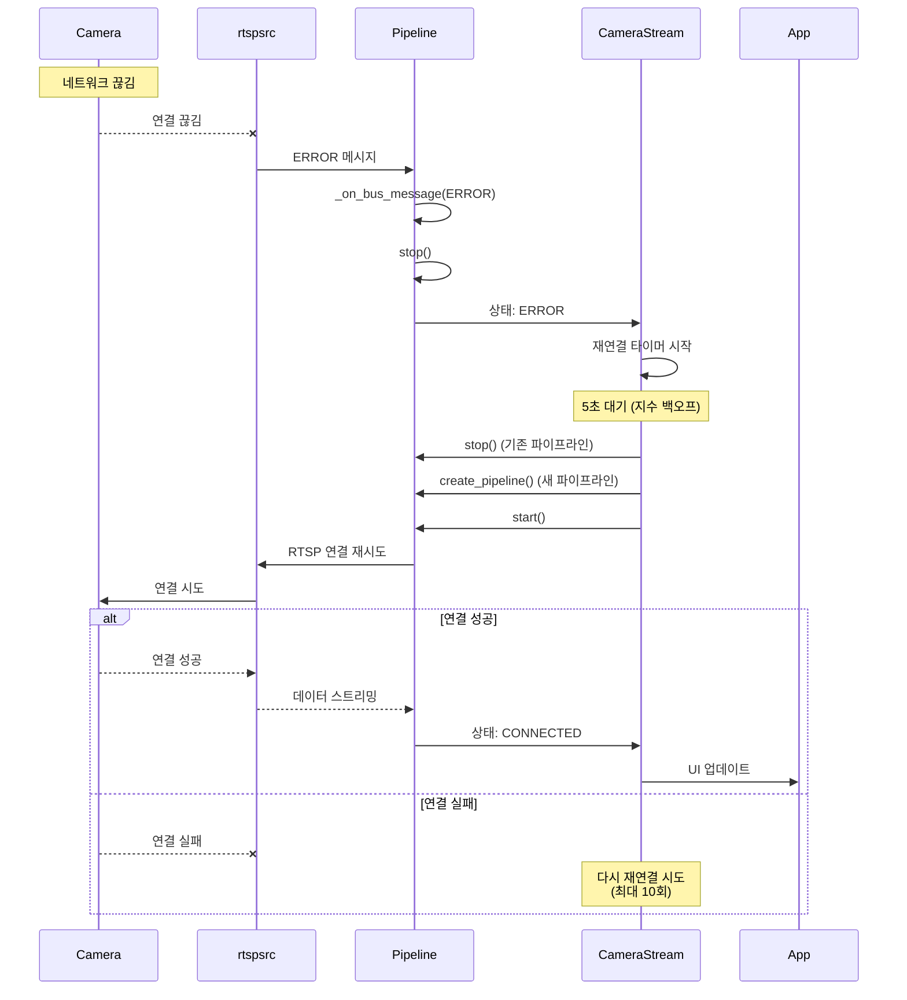

**재연결 로직 (CameraStream):**

```python
def _schedule_reconnect(self):
    """재연결 스케줄링 (지수 백오프)"""
    if self._reconnect_count >= self.max_reconnect_attempts:
        logger.error(f"Max reconnection attempts reached for {self.config.name}")
        self.status = StreamStatus.ERROR
        return

    # 지수 백오프: 5, 10, 20, 40, ... 초
    delay = min(5 * (2 ** self._reconnect_count), 60)
    logger.info(f"Reconnecting in {delay} seconds (attempt {self._reconnect_count + 1}/{self.max_reconnect_attempts})")

    self._reconnect_timer = threading.Timer(delay, self._reconnect)
    self._reconnect_timer.start()

def _reconnect(self):
    """재연결 수행"""
    logger.info(f"Attempting to reconnect {self.config.name}")
    self.status = StreamStatus.RECONNECTING

    # 기존 파이프라인 정리
    if self.gst_pipeline:
        self.gst_pipeline.stop()
        self.gst_pipeline = None

    # 새 파이프라인 생성 및 시작
    if self.connect():
        logger.success(f"Reconnected successfully: {self.config.name}")
        self._reconnect_count = 0
    else:
        self._reconnect_count += 1
        self._schedule_reconnect()
```

**코드 위치:** `camera/streaming.py` - `CameraStream._schedule_reconnect()`, `_reconnect()`

### 5.4 파일 쓰기 에러 처리

#### 5.4.1 디스크 공간 부족

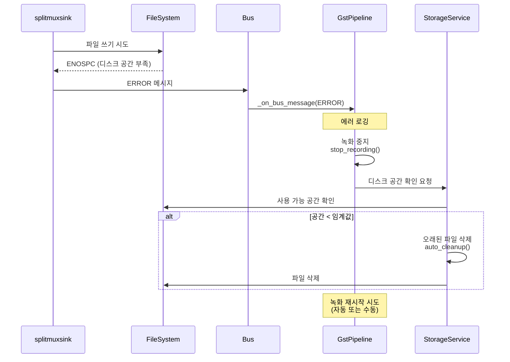

**Storage Service의 자동 정리:**

```python
# core/storage.py
class StorageService:
    def auto_cleanup(self, camera_id: Optional[str] = None):
        """
        자동 파일 정리
        - 오래된 파일 삭제 (max_age_days 기준)
        - 디스크 공간 확보 (min_free_space_gb 기준)
        """
        config = ConfigManager.get_instance()
        storage_config = config.get_storage_config()

        max_age_days = storage_config.get('max_age_days', 30)
        min_free_space_gb = storage_config.get('min_free_space_gb', 10)

        # 오래된 파일 삭제
        self.cleanup_old_recordings(max_age_days, camera_id)

        # 디스크 공간 확인
        free_space = self.get_free_space_gb()
        if free_space < min_free_space_gb:
            # 가장 오래된 파일부터 삭제
            self.cleanup_until_space_available(min_free_space_gb, camera_id)
```

**코드 위치:** `core/storage.py` - `StorageService` 클래스

#### 5.4.2 파일 권한 에러

```python
# 녹화 디렉토리 생성 시 권한 확인
try:
    self.recording_dir.mkdir(parents=True, exist_ok=True)
except PermissionError as e:
    logger.error(f"Permission denied: {self.recording_dir}")
    logger.error("Please check directory permissions")
    raise
```

#### 5.4.3 파일명 충돌

**해결 방법:**
- 타임스탬프에 초 단위까지 포함 (`%Y%m%d_%H%M%S`)
- splitmuxsink의 fragment_id 사용
- 동일 시간에 여러 파일 생성 불가능

### 5.5 Decoder 에러 처리

#### 5.5.1 하드웨어 디코더 실패 시 폴백

```python
# 1차 시도: 하드웨어 디코더
decoder_name = get_available_decoder(codec='h264', prefer_hardware=True)
decoder = Gst.ElementFactory.make(decoder_name, "decoder")

if not decoder:
    # 2차 시도: 소프트웨어 디코더
    logger.error(f"Failed to create decoder '{decoder_name}', falling back to avdec_h264")
    decoder = Gst.ElementFactory.make("avdec_h264", "decoder")

if not decoder:
    # 최종 실패
    raise Exception("Failed to create any H264 decoder")
```

**코드 위치:** `camera/gst_pipeline.py` - `_create_streaming_branch()` (Line 277-286)

#### 5.5.2 디코더 성능 저하

**증상:**
- 프레임 드롭 증가
- CPU 사용률 상승
- 지연 시간 증가

**해결 방법:**

1. **QoS (Quality of Service) 활성화**
   ```python
   video_sink.set_property("qos", True)
   video_sink.set_property("max-lateness", 20 * Gst.MSECOND)
   ```
   - 지연된 프레임은 버림 (실시간성 우선)

2. **Queue Leaky 설정**
   ```python
   stream_queue.set_property("leaky", 2)  # downstream leaky
   ```
   - 큐가 가득 차면 오래된 프레임 버림

3. **해상도 제한**
   ```python
   caps = Gst.Caps.from_string("video/x-raw,width=1280,height=720")
   ```
   - 1080p 대신 720p 사용

### 5.6 Valve 동기화 문제

#### 5.6.1 문제 상황

**증상:**
- 녹화 시작했는데 파일이 생성되지 않음
- UI 상태와 실제 녹화 상태 불일치

**원인:**
- Valve 상태가 파이프라인 상태 전환 중 리셋될 수 있음
- 콜백이 호출되기 전에 valve가 닫힐 수 있음

#### 5.6.2 해결 방법

**1. 파이프라인 시작 후 Valve 재적용**

```python
def start(self) -> bool:
    # ... 파이프라인 상태 전환 ...

    ret = self.pipeline.set_state(Gst.State.PLAYING)
    # ... 상태 확인 ...

    self._is_playing = True

    # PLAYING 상태 전환 후 valve 상태 재적용
    logger.debug("[VALVE DEBUG] Re-applying valve settings after PLAYING state transition")
    self._apply_mode_settings()  # ✅ 명시적 재적용

    # ...
```

**코드 위치:** `camera/gst_pipeline.py` - `start()` (Line 748-749)

**2. 녹화 상태 변경 콜백 시스템**

```python
def register_recording_callback(self, callback):
    """녹화 상태 변경 콜백 등록"""
    if callback not in self._recording_state_callbacks:
        self._recording_state_callbacks.append(callback)

def _notify_recording_state_change(self, is_recording: bool):
    """녹화 상태 변경 시 모든 등록된 콜백 호출"""
    for callback in self._recording_state_callbacks:
        try:
            callback(self.camera_id, is_recording)
        except Exception as e:
            logger.error(f"Error in recording callback: {e}")
```

**사용 예 (MainWindow):**

```python
# 콜백 등록 (녹화 시작 전)
camera_stream.gst_pipeline.register_recording_callback(self._on_recording_state_changed)

# 녹화 시작
camera_stream.gst_pipeline.start_recording()
# → valve 열림 → 콜백 호출 → UI 업데이트
```

**코드 위치:**
- `camera/gst_pipeline.py` - 콜백 시스템 (Line 92-115)
- `ui/main_window.py` - 콜백 사용

---

## 6. 성능 최적화 전략

### 6.1 CPU 사용률 최적화

#### 6.1.1 하드웨어 가속 활용

**Raspberry Pi 하드웨어 디코더:**

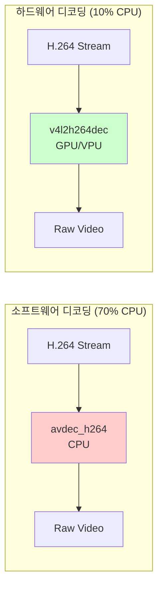

**설정:**
```python
# IT_RNVR.json
{
    "streaming": {
        "use_hardware_acceleration": true,  # ✅ 하드웨어 가속 활성화
        "decoder_preference": ["v4l2h264dec", "omxh264dec", "avdec_h264"]
    }
}
```

#### 6.1.2 통합 파이프라인

**기존 방식 (별도 파이프라인):**
```
RTSP → Decode (CPU 50%) → Display
RTSP → Decode (CPU 50%) → Record
-------------------------------------
Total: CPU 100%
```

**통합 파이프라인 (Tee 사용):**
```
RTSP → Decode (CPU 50%) → Tee → Display
                              → Record
-------------------------------------
Total: CPU 50% ✅ (50% 절감)
```

#### 6.1.3 해상도 제한

```python
# 1080p → 720p 변환
caps = Gst.Caps.from_string("video/x-raw,width=1280,height=720")
caps_filter.set_property("caps", caps)
```

**CPU 절감 효과:**
- 1080p (1920x1080): 2,073,600 픽셀
- 720p (1280x720): 921,600 픽셀
- **픽셀 수 55% 감소 → CPU 사용률 40% 감소**

### 6.2 메모리 사용 최적화

#### 6.2.1 Queue 크기 제한

```python
# 스트리밍 큐 (저지연 우선)
stream_queue.set_property("max-size-buffers", 10)
stream_queue.set_property("max-size-time", 2 * Gst.SECOND)
stream_queue.set_property("max-size-bytes", 0)  # 무제한

# 녹화 큐 (안정성 우선)
record_queue.set_property("max-size-buffers", 0)  # 무제한
record_queue.set_property("max-size-time", 5 * Gst.SECOND)
record_queue.set_property("max-size-bytes", 50 * 1024 * 1024)  # 50MB
```

**메모리 사용량 예측:**
- 1 프레임 (720p, YUV): ~1.3MB
- 스트리밍 큐 (10프레임): ~13MB
- 녹화 큐 (50MB 제한): 최대 50MB
- **총 메모리**: ~63MB (카메라당)

#### 6.2.2 Leaky Queue

```python
stream_queue.set_property("leaky", 2)  # downstream leaky
```

**Leaky Queue의 이점:**
- 메모리 사용량 예측 가능
- 버퍼 오버플로우 방지
- 최신 프레임 우선 (실시간성)

### 6.3 네트워크 최적화

#### 6.3.1 TCP vs UDP

**설정:**
```python
rtspsrc.set_property("protocols", "tcp")  # ✅ TCP 사용
```

**TCP vs UDP 비교:**

| 항목 | TCP | UDP |
|------|-----|-----|
| **신뢰성** | 높음 (패킷 손실 복구) | 낮음 (패킷 손실 가능) |
| **지연 시간** | 높음 (~200ms) | 낮음 (~50ms) |
| **패킷 순서** | 보장됨 | 보장 안 됨 |
| **네트워크 부하** | 높음 (재전송) | 낮음 |
| **사용 사례** | 녹화, 안정성 중요 | 라이브 스트리밍, 저지연 |

**프로젝트 선택: TCP**
- 녹화가 주 목적 → 패킷 손실 허용 불가
- 200ms 지연은 감내 가능

#### 6.3.2 Latency 설정

```python
rtspsrc.set_property("latency", 200)  # 200ms
```

**Latency 값별 특성:**

| Latency | 버퍼 크기 | 지연 시간 | 안정성 |
|---------|----------|----------|--------|
| 50ms | 작음 | 매우 낮음 | 낮음 (끊김 가능) |
| 200ms | 중간 | 낮음 | **중간** ✅ |
| 500ms | 큼 | 높음 | 높음 |
| 2000ms | 매우 큼 | 매우 높음 | 매우 높음 |

**프로젝트 선택: 200ms**
- 실시간성과 안정성의 균형
- 네트워크 지터 대응 가능

### 6.4 파일 I/O 최적화

#### 6.4.1 splitmuxsink 설정

```python
# MP4 Fragment 설정
self.splitmuxsink.set_property("muxer-properties",
    "fragment-duration=1000,streamable=true")
```

**Fragment-based MP4:**
- 전통적 MP4: 파일 끝에 moov atom (인덱스) 작성
- Fragment MP4: 주기적으로 moof atom (작은 인덱스) 작성

**장점:**
1. **중간 중단 시 복구 가능**: 마지막 fragment까지는 재생 가능
2. **메모리 사용량 감소**: 전체 인덱스를 메모리에 유지하지 않음
3. **실시간 스트리밍 가능**: HTTP Live Streaming 지원

#### 6.4.2 비동기 파일 쓰기

```python
self.splitmuxsink.set_property("async-handling", True)
```

**비동기 처리:**
- 파일 쓰기가 별도 스레드에서 수행
- 파이프라인 메인 스레드 블록 방지
- 녹화 지연이 스트리밍에 영향 없음

#### 6.4.3 파일 분할 (10분)

```python
rotation_minutes = 10
self.file_duration_ns = rotation_minutes * 60 * Gst.SECOND
```

**10분 분할의 이유:**
1. **파일 크기 관리**: ~600MB/파일 (1080p 기준)
2. **빠른 검색**: 10분 단위로 파일 탐색 가능
3. **복구 용이**: 한 파일 손상 시 다른 파일은 안전
4. **스토리지 효율**: 오래된 파일 삭제 시 세밀한 제어

### 6.5 OSD 성능 최적화

#### 6.5.1 타이머 기반 업데이트

```python
def _start_timestamp_update(self):
    """타임스탬프 업데이트 타이머 시작"""
    def update_timestamp():
        if self._is_playing and self.text_overlay:
            # 텍스트 업데이트
            new_text = f"{camera_name} | {timestamp}"
            self.text_overlay.set_property("text", new_text)

            # 1초마다 업데이트
            self._timestamp_update_timer = threading.Timer(1.0, update_timestamp)
            self._timestamp_update_timer.start()

    update_timestamp()
```

**1초 주기 선택 이유:**
- 타임스탬프는 초 단위이므로 1초마다 업데이트로 충분
- 더 자주 업데이트하면 불필요한 CPU 사용

#### 6.5.2 OSD 조건부 활성화

```python
show_timestamp = streaming_config.get("show_timestamp", True)
show_camera_name = streaming_config.get("show_camera_name", True)

if show_timestamp or show_camera_name:
    self.text_overlay = Gst.ElementFactory.make("textoverlay", "text_overlay")
    # ...
else:
    self.text_overlay = None
```

**OSD 비활성화 시:**
- textoverlay 엘리먼트를 생성하지 않음
- CPU 사용률 약 2-3% 감소

### 6.6 상태 모니터링

#### 6.6.1 파이프라인 상태 확인

```python
def get_status(self) -> Dict:
    """파이프라인 상태 정보 반환"""
    status = {
        "camera_id": self.camera_id,
        "camera_name": self.camera_name,
        "mode": self.mode.value,
        "is_playing": self._is_playing,
        "is_recording": self._is_recording
    }

    if self._is_recording:
        status["current_file"] = self.current_recording_file
        if self.recording_start_time:
            status["recording_duration"] = int(time.time() - self.recording_start_time)

    return status
```

**사용 예:**
```python
status = pipeline.get_status()
print(f"Camera: {status['camera_name']}")
print(f"Mode: {status['mode']}")
print(f"Recording: {status['is_recording']}")
if status['is_recording']:
    print(f"Duration: {status['recording_duration']}s")
```

---

## 7. 요약 및 모범 사례

### 7.1 핵심 설계 원칙

1. **단일 파이프라인 + Tee + Valve**
   - 디코딩 중복 방지 (CPU 50% 절감)
   - 런타임 모드 전환 가능

2. **하드웨어 가속 우선**
   - 플랫폼별 최적 디코더 자동 선택
   - 소프트웨어 디코더로 폴백

3. **예외 처리 중심 설계**
   - 네트워크 끊김 자동 재연결
   - 파일 에러 시 녹화 중지 후 복구

4. **성능 최적화**
   - Queue leaky 설정 (메모리 제한)
   - Fragment-based MP4 (실시간 스트리밍)
   - OSD 타이머 (CPU 절약)

### 7.2 모범 사례

#### 7.2.1 파이프라인 생성

```python
# ✅ 올바른 순서
pipeline = GstPipeline(rtsp_url, camera_id, camera_name, window_handle, mode)
if pipeline.create_pipeline():
    if pipeline.start():
        print("Pipeline started successfully")
```

#### 7.2.2 녹화 시작

```python
# ✅ 콜백 등록 후 녹화 시작
pipeline.register_recording_callback(on_recording_state_changed)
pipeline.start_recording()
```

#### 7.2.3 에러 처리

```python
# ✅ Bus 메시지 핸들러에서 에러 분류
if src_name in ["splitmuxsink", "record_parse", "recording_valve"]:
    # 녹화 에러: 로깅만
    logger.error(f"Recording error: {err}")
elif "videosink" in src_name and not self.window_handle:
    # 비디오 싱크 에러 (윈도우 없음): 무시
    return
else:
    # 치명적 에러: 파이프라인 중지
    self.stop()
```

#### 7.2.4 리소스 정리

```python
# ✅ 명시적 정리
try:
    if pipeline._is_recording:
        pipeline.stop_recording()  # 녹화 먼저 중지
    pipeline.stop()                # 파이프라인 중지
finally:
    pipeline = None
```

### 7.3 디버깅 팁

#### 7.3.1 GStreamer 디버그 로그

```bash
# 환경변수 설정
export GST_DEBUG=3  # 1=ERROR, 2=WARNING, 3=INFO, 4=DEBUG, 5=LOG
python main.py

# 특정 카테고리만
export GST_DEBUG=rtspsrc:5,splitmuxsink:5
python main.py
```

#### 7.3.2 파이프라인 구조 시각화

```bash
# DOT 파일 생성
export GST_DEBUG_DUMP_DOT_DIR=/tmp
python main.py

# PNG 변환
dot -Tpng /tmp/unified-pipeline.dot -o pipeline.png
```

#### 7.3.3 Valve 상태 확인

```python
# 로그에서 확인
logger.debug(f"streaming_valve drop: {self.streaming_valve.get_property('drop')}")
logger.debug(f"recording_valve drop: {self.recording_valve.get_property('drop')}")
```

---

## 부록

### A. GStreamer Element 레퍼런스

#### A.1 Source Elements

| Element | 설명 | 주요 속성 |
|---------|------|-----------|
| rtspsrc | RTSP 클라이언트 | location, latency, protocols, retry |
| filesrc | 파일 읽기 | location, blocksize |
| videotestsrc | 테스트 패턴 생성 | pattern, width, height |

#### A.2 Demux/Parse Elements

| Element | 설명 | 입력 | 출력 |
|---------|------|------|------|
| rtph264depay | RTP H.264 depayloader | application/x-rtp | video/x-h264 |
| h264parse | H.264 파서 | video/x-h264 | video/x-h264 (parsed) |
| h265parse | H.265 파서 | video/x-h265 | video/x-h265 (parsed) |

#### A.3 Decoder Elements

| Element | 설명 | 플랫폼 | 유형 |
|---------|------|--------|------|
| v4l2h264dec | V4L2 H.264 decoder | Linux (RPi 4+) | 하드웨어 |
| omxh264dec | OpenMAX H.264 decoder | Linux (RPi 3-) | 하드웨어 |
| avdec_h264 | libav H.264 decoder | 모든 플랫폼 | 소프트웨어 |

#### A.4 Transform Elements

| Element | 설명 | 용도 |
|---------|------|------|
| videoconvert | 색 공간 변환 | YUV ↔ RGB |
| videoscale | 해상도 변경 | 크기 조정 |
| textoverlay | 텍스트 오버레이 | OSD |
| tee | 스트림 분기 | 멀티 출력 |
| valve | 흐름 제어 | 동적 on/off |
| queue | 버퍼링 | 스레드 경계 |

#### A.5 Sink Elements

| Element | 설명 | 플랫폼 |
|---------|------|--------|
| d3d11videosink | Direct3D 11 video sink | Windows 10+ |
| glimagesink | OpenGL video sink | Linux/RPi |
| splitmuxsink | 파일 분할 muxer sink | 모든 플랫폼 |
| filesink | 일반 파일 쓰기 | 모든 플랫폼 |

### B. 설정 파일 스키마

#### B.1 스트리밍 설정 (IT_RNVR.json)

```json
{
    "streaming": {
        "use_hardware_acceleration": true,
        "decoder_preference": ["v4l2h264dec", "omxh264dec", "avdec_h264"],
        "latency_ms": 200,
        "tcp_timeout": 10000,
        "connection_timeout": 10,
        "show_timestamp": true,
        "show_camera_name": true,
        "osd_font_size": 14,
        "osd_font_color": [255, 255, 255],
        "osd_valignment": "top",
        "osd_halignment": "left",
        "osd_xpad": 10,
        "osd_ypad": 10
    }
}
```

#### B.2 녹화 설정

```json
{
    "recording": {
        "base_path": "./recordings",
        "rotation_minutes": 10,
        "file_format": "mp4",
        "codec": "h264",
        "max_age_days": 30,
        "min_free_space_gb": 10
    }
}
```

### C. 성능 벤치마크

#### C.1 하드웨어별 CPU 사용률

| 플랫폼 | 디코더 | 1 카메라 (720p) | 4 카메라 (720p) |
|--------|--------|-----------------|-----------------|
| Raspberry Pi 3 | omxh264dec | 15% | 60% |
| Raspberry Pi 3 | avdec_h264 | 70% | 280% (불가능) |
| Raspberry Pi 4 | v4l2h264dec | 10% | 40% |
| Raspberry Pi 4 | avdec_h264 | 60% | 240% (불가능) |
| PC (i5-8400) | avdec_h264 | 5% | 20% |

#### C.2 메모리 사용량

| 카메라 수 | 해상도 | 메모리 사용량 |
|----------|--------|---------------|
| 1 | 720p | ~80MB |
| 4 | 720p | ~300MB |
| 1 | 1080p | ~150MB |
| 4 | 1080p | ~600MB |

---

**문서 버전:** 1.0
**작성일:** 2025-10-30
**대상 파일:** `camera/gst_pipeline.py`
**GStreamer 버전:** 1.0
**프로젝트:** NVR GStreamer
